# Formula Analyst

Race analysis dashboard built on [FastF1](https://github.com/theOehrly/Fast-F1) timing data. Pick a Grand Prix and see how the race played out, or follow a whole championship season. Every race from 2018 to the latest 2026 round is included.

**[Open the live app](https://formula-analyst.streamlit.app/)**

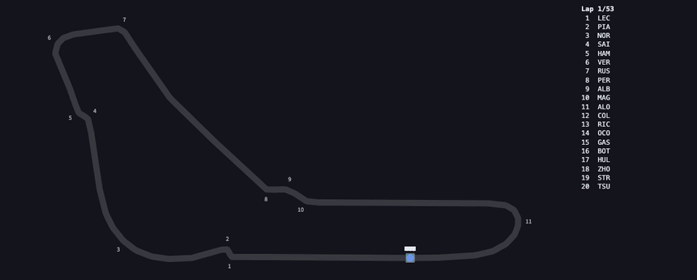

## Features

**Race**

Every race opens with a summary: the podium, the fastest lap, the number of pit stops and any safety car, virtual safety car or red flag. The analysis is split into five tabs.

- **Overview.** Every driver's position lap by lap, with selected drivers highlighted, plus who led and for how many laps. The gap to the leader through the race, with safety car laps shaded. Track and air temperature and any rain. Race control's decisions, from penalties and investigations to lap times deleted for track limits. Team radio clips, which play in the page.
- **Replay.** Every car on a map of the circuit through the whole race, with the running order alongside. Play it or drag the slider lap by lap.
- **Pace.** Lap times for any set of drivers, optionally limited to representative laps (no pit in/out laps, no laps under safety car or flags, no laps FastF1 marks as inaccurate) and fuel-corrected. Each team's lap time spread ordered by median pace, and each driver's lap time distribution coloured by tyre compound. The quickest driver in each sector and every driver's theoretical best lap, and top speed against corner speed, which shows who ran a low-drag setup and who ran more downforce.
- **Strategy.** Every driver's stints, coloured by compound and ordered by finishing position. Every pit stop's time in the pit lane by team, how much a stop cost, and which undercuts worked. The degradation rate of each stint from a linear fit of fuel-corrected lap time against tyre age, summarised by compound. A machine learning model trained on every other race since 2019 predicts how much time each compound should lose at that circuit, shown against the race's actual laps. A strategy simulator uses it to rank every one- and two-stop plan and compares the fastest with the winner's strategy.
- **Telemetry.** Two drivers' fastest laps channel by channel: speed, the gap between them, throttle, brake, gear, RPM and DRS against distance, with corner markers. Corner by corner minimum speeds and braking points, and the same laps on a track map coloured by speed, by gear or by who was quicker in each mini-sector.

**Championship**

- Standings after any round, with each driver's maximum possible points and whether they can still win the title.
- Points progression through the season.
- Points per round for every driver, race and sprint combined.

Every view has its own link, so a race, a tab or a point in a championship can be shared directly, for example the [2023 British Grand Prix strategy](https://formula-analyst.streamlit.app/?season=2023&race=british-grand-prix&tab=strategy) or the [2021 standings after Silverstone](https://formula-analyst.streamlit.app/championship?season=2021&round=10). The app follows the system's light or dark setting, and drivers are drawn in their teams' official colours. Every chart is interactive: hover a point for its lap time, tyre, position or speed.

<picture>
  <source media="(prefers-color-scheme: dark)" srcset="docs/overview-dark.png">
  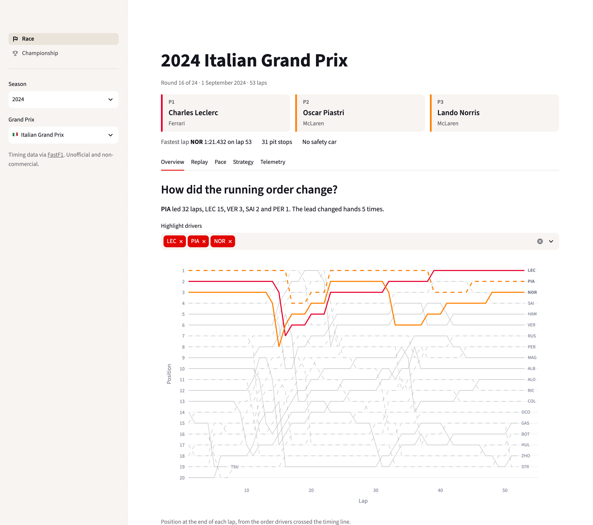
</picture>

| Telemetry | Strategy simulator |
| --- | --- |
| 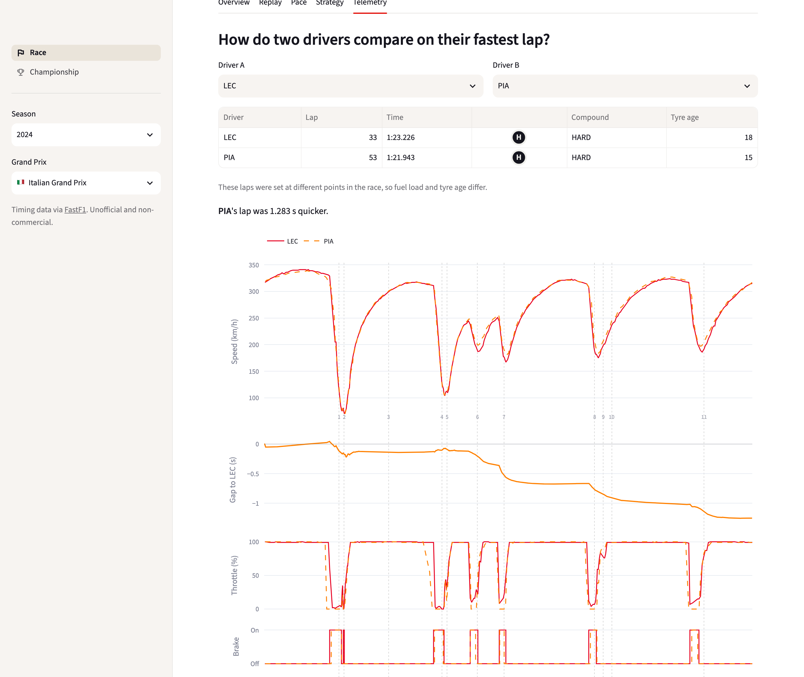 | 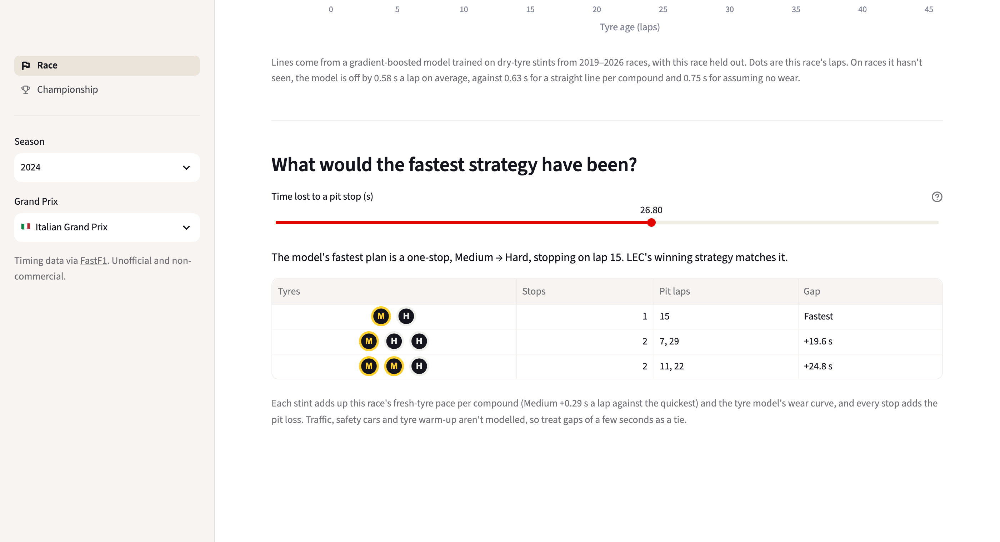 |
| **Gap to the leader** | **Pit stops and undercuts** |
| 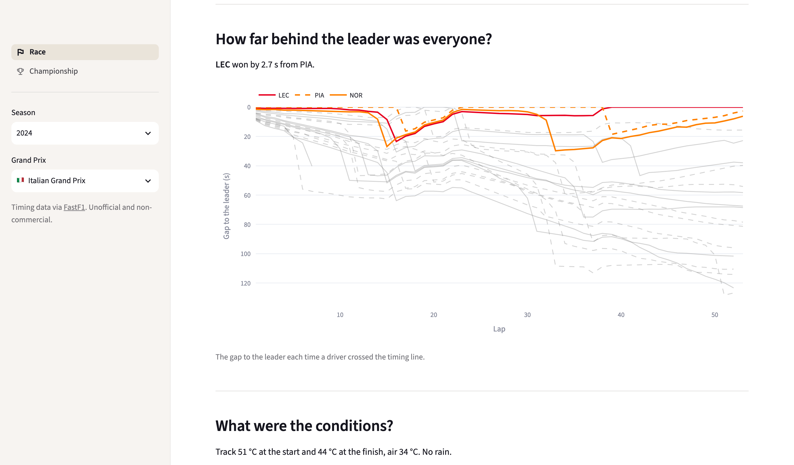 | 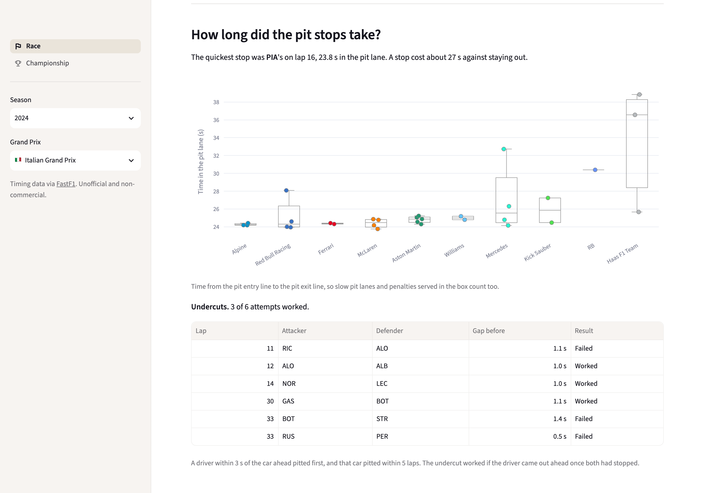 |
| **Pace** | **Team pace** |
| 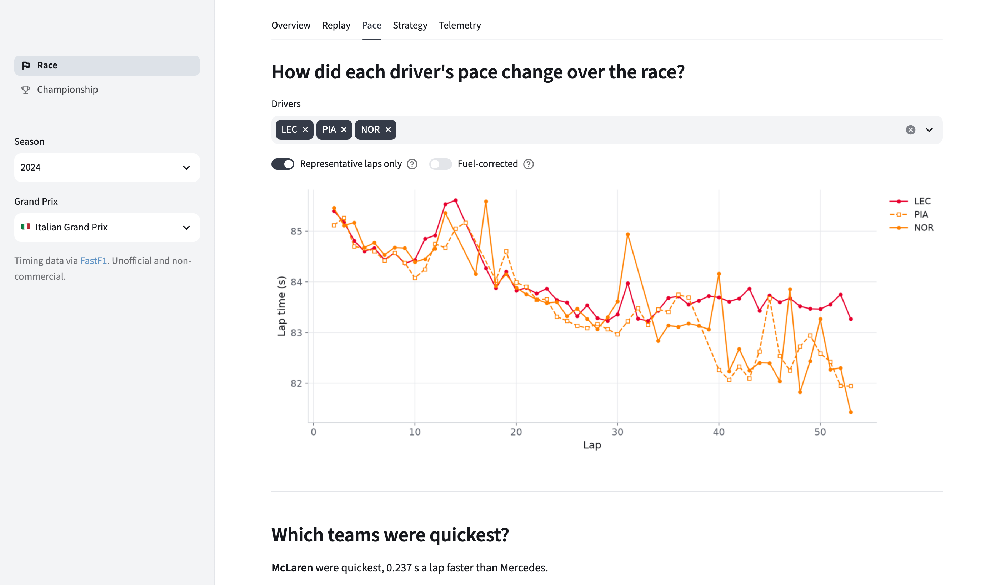 | 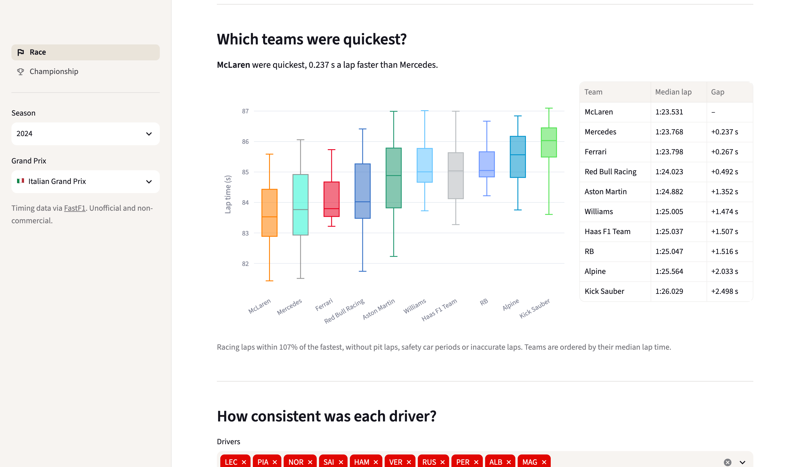 |
| **Strategy** | **Tyre model** |
| 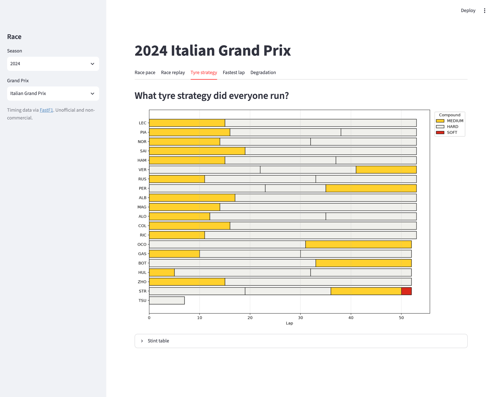 | 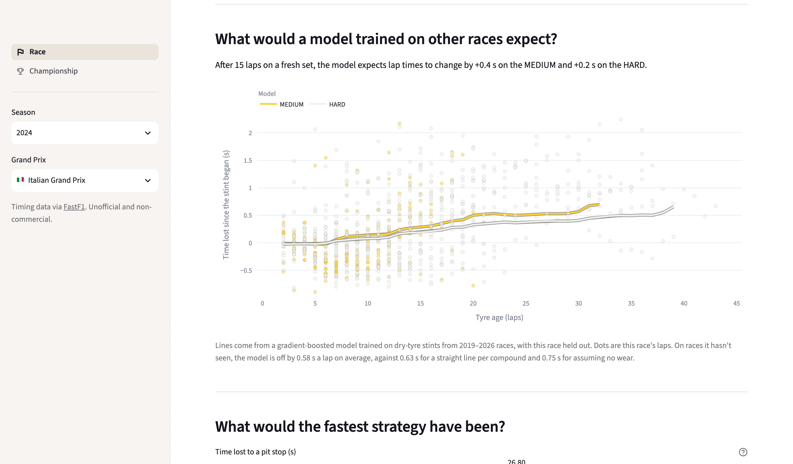 |
| **Sectors** | **Race control** |
| 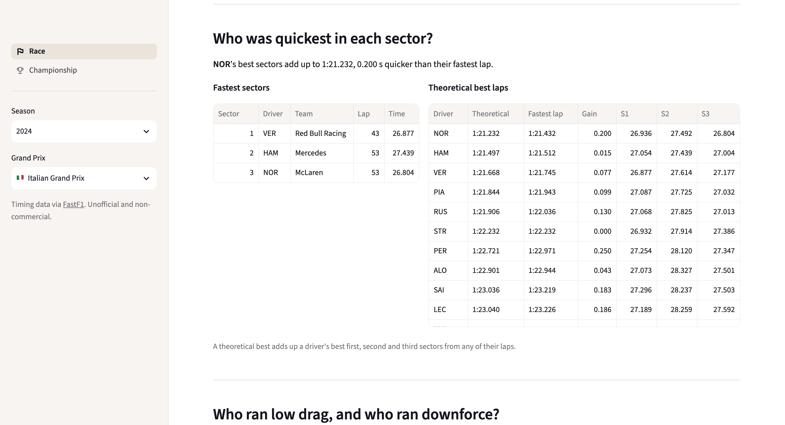 | 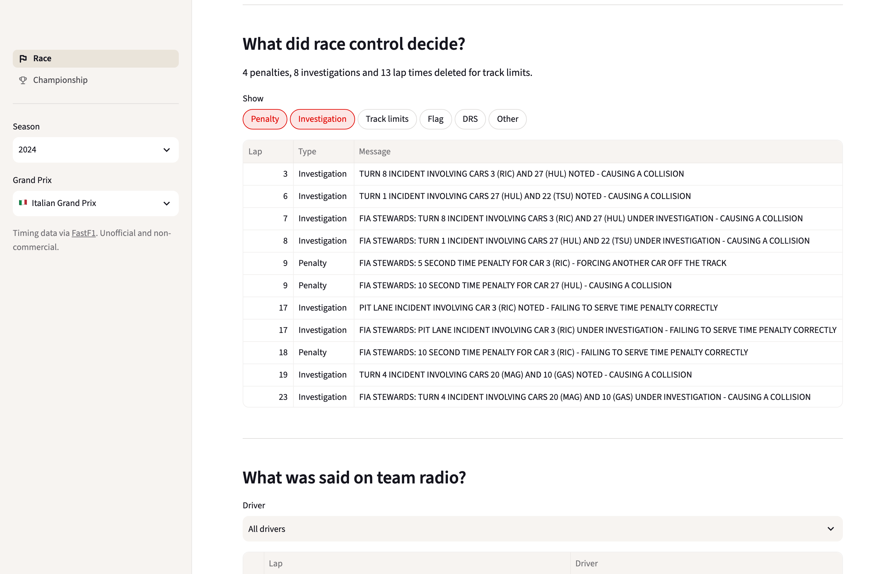 |
| **Championship** | |
| 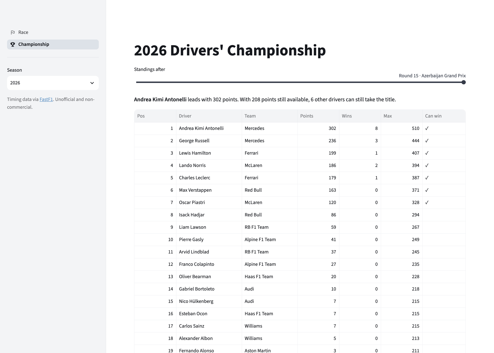 | |

## Running locally

Requires Python 3.11 or newer.

```bash
python -m venv .venv
source .venv/bin/activate
pip install -r requirements.txt
streamlit run app.py
```

## Race data

Every race from 2018 to the latest 2026 round ships with the app in `data/` (about 40 MB), as compact Parquet files: the lap table with sector times and speed traps, each driver's fastest-lap telemetry, the track outline, the weather, race control messages and the list of team radio clips. The one exception is the 2018 Italian Grand Prix, whose tyre data FastF1 can't process. Each season also has its race and sprint results and its calendar. The radio audio itself isn't bundled; the browser streams it from the official timing service when a clip is played. The live timing service rejects requests from many hosting providers, Streamlit Community Cloud included, so the deployed app reads only this bundle.

When the live timing service is reachable, as it usually is on a home connection, the app also downloads races that aren't bundled. The first download of a race takes about a minute and is cached in `cache/`.

After a race weekend, one command adds the new races, updates the championship and retrains the tyre model:

```bash
pip install -r requirements-dev.txt
python -m src.sync
```

It defaults to the current season. Other forms:

```bash
python -m src.sync 2023 --event Monza --event Silverstone --force
python -m src.sync 2026 --results-only
python -m src.sync 2022 --upgrade --skip-model
```

Saved races are skipped unless `--force` is passed, and `--results-only` updates the championship without downloading races. `--upgrade` downloads saved races again when they were saved in an older format, so they pick up data added since, and `--skip-model` leaves the tyre model as it is. The sync has to run on a connection the live timing service accepts; it rejects GitHub's servers as well as Streamlit's, so it can't run as a scheduled workflow. FastF1 allows 500 requests an hour, roughly 15 races; when a limit is reached the command stops and can be run again later to continue. Set `FORMULA_ANALYST_OFFLINE=1` to run the app the way it runs when deployed, with bundled races only.

## Development

```bash
pip install -r requirements-dev.txt
pytest
ruff check .
ruff format --check .
python -m src.model
```

The last command retrains the tyre model on the bundled races and writes its curves and metrics to `data/tyre-model/`. scikit-learn is only needed for that step, so the deployed app doesn't install it.

```
app.py                  page navigation
views/race.py           race page: sidebar, header and tabs
views/*_tab.py          one module per race tab
views/championship.py   championship page
views/data.py           cached data loading for both pages
views/theme.py          colours and styles shared by the pages
views/links.py          shareable links from URL parameters
views/state.py          keeps widget values when switching tabs
views/tyres.py          tyre compound badges
views/text.py           small helpers for the generated sentences
src/analysis.py         positions, pace, gaps, replay and the other race charts
src/charts.py           chart styling shared by every figure
src/telemetry.py        telemetry channels, lap delta, corner speeds and gear map
src/strategy.py         pit stops, undercuts and the strategy simulator
src/sectors.py          sector times, theoretical best laps and speed traps
src/conditions.py       weather, race control messages and team radio
src/championship.py     standings, title maths and championship charts
src/races.py            loading races from FastF1 or the bundle, saving bundles
src/seasons.py          loading and saving season results
src/degradation.py      time lost to tyre wear in each stint, and the saved model curves
src/model.py            training and cross-validating the tyre model
src/sync.py             command line tool that builds the bundle
data/                   bundled races and season results
tests/                  unit tests
```

Everything in `src/` works on plain pandas DataFrames and has no Streamlit dependency; only `src/races.py`, `src/seasons.py` and `src/sync.py` use FastF1, and only `src/model.py` uses scikit-learn.

## Methodology

- **Race summary.** Safety car and virtual safety car periods are counted in the winner's laps that ran under them. Pit stops leave out pit lane entries during a red flag, when every car waits in the pit lane. Laps led and lead changes come from the running order at the end of each lap.
- **Fuel correction** subtracts `fuel_effect × laps remaining` from each lap time, normalising every lap to an empty tank. The default is 0.055 s per lap of fuel and can be changed in the app.
- **Degradation** is the slope of a least-squares line through fuel-corrected lap time against tyre age, fitted per stint. Stints shorter than the configurable minimum (8 laps by default) are skipped.
- A straight line is a simplification: tyre warm-up at the start of a stint and the drop-off at the end are averaged into one number.
- **Tyre model.** For every dry stint from 2019 onwards, when the compounds were named soft, medium and hard, each representative lap's fuel-corrected time is compared with the median of the stint's first three laps. That gives the time lost since the stint began, which includes tyre wear and the track rubbering in. A gradient-boosted tree model (scikit-learn's `HistGradientBoostingRegressor`) predicts it from the compound, tyre age, the age of the set when the stint began, the circuit, the season and the race's median track temperature. It is trained on 126,491 laps from 6,458 stints in 161 races. Cross-validated in five folds grouped by race, so every race is predicted by a model that never saw it, it is off by 0.58 s a lap on average, against 0.63 s for a straight line per compound and 0.75 s for assuming no wear. Lap-to-lap variation from traffic and driving limits how close any model can get. Track temperature was a later addition and barely matters: it brought the error from 0.584 s to 0.581 s, lower on every random split tested, but it helped only about half of the races individually, so the effect is small. The curves shown for each race come from the fold that held it out.
- **Positions** are the order in which drivers completed each lap. They match FastF1's own position data.
- **Gap to the leader** is the time between each driver and the leader crossing the timing line at the end of a lap. Safety car and virtual safety car laps are the leader's laps that ran under them.
- **Pit stops.** Time in the pit lane runs from the pit entry line on the in-lap to the pit exit line on the out-lap, so it includes the drive through the lane and any penalty served in the box. The cost of a stop is the in-lap plus the out-lap minus two of the driver's typical green-flag laps, and the race's pit loss is the median of those.
- **Undercuts.** A driver within 3 s of the car ahead pits first, and that car pits within the next 5 laps. The undercut worked if the driver was ahead once both had stopped.
- **Strategy simulator.** Each compound's fresh-tyre pace comes from a least-squares fit of this race's representative laps on compound, tyre age per compound, driver and lap number, so a faster driver or a lighter car doesn't make a compound look quicker. Wear comes from the tyre model's curve for this race. Every plan with one or two stops and at least two dry compounds is timed, with stints of at least 5 laps and no longer than the model's curve reaches. Traffic, safety cars and tyre warm-up aren't modelled.
- **Sectors.** A theoretical best adds up a driver's best first, second and third sectors from any accurate lap. Top speed is the highest speed trap reading of the race, and corner speed is the mean minimum speed through every corner on the driver's fastest lap.
- **Corner by corner.** Each corner covers the track halfway to its neighbours. The minimum speed is the slowest point in that stretch, and the braking point is how far before the corner marker the driver last went on the brakes before the apex. Car data is sampled about four times a second, so short brake taps can be missed.
- **Race control** messages are grouped by keyword into penalties, investigations, track limits, flags, safety car and DRS, and blue flags are left out.
- **Weather** for each lap is the last reading from the circuit's weather station before the leader completed it.
- **Pace comparison** uses representative laps within 107% of the fastest one, the same quick-lap threshold as FastF1.
- **Mini-sectors** split the fastest lap into 25 equal distances. A driver's time through each one comes from integrating their speed trace.
- **Race replay** positions come from each lap's start and end times. Within a lap, cars follow the speed profile of the winner's fastest lap, so they slow down in corners rather than moving at constant speed. The order shown is the order on track, before any penalties. Track outlines come from the MultiViewer circuit data that FastF1 uses; the 2020 Sakhir and 2026 Spanish Grand Prix have none.
- **Championship standings** add up race and sprint points after each round and break ties by countback over classified finishes. They match the official standings for every bundled season.
- **Who can still win** compares the leader's points with each driver's points plus the most still available: a race win (and the fastest-lap point from 2019 to 2024) for every remaining round, plus a sprint win where there is one.

## Data and license

Timing data is provided by FastF1, and the bundled data is derived from it. Race and sprint results come from the [Jolpica F1 API](https://github.com/jolpica/jolpica-f1), the successor to Ergast, through FastF1. This is an unofficial, non-commercial project and is not affiliated with any racing series or its rights holders.

Released under the [MIT License](LICENSE).
