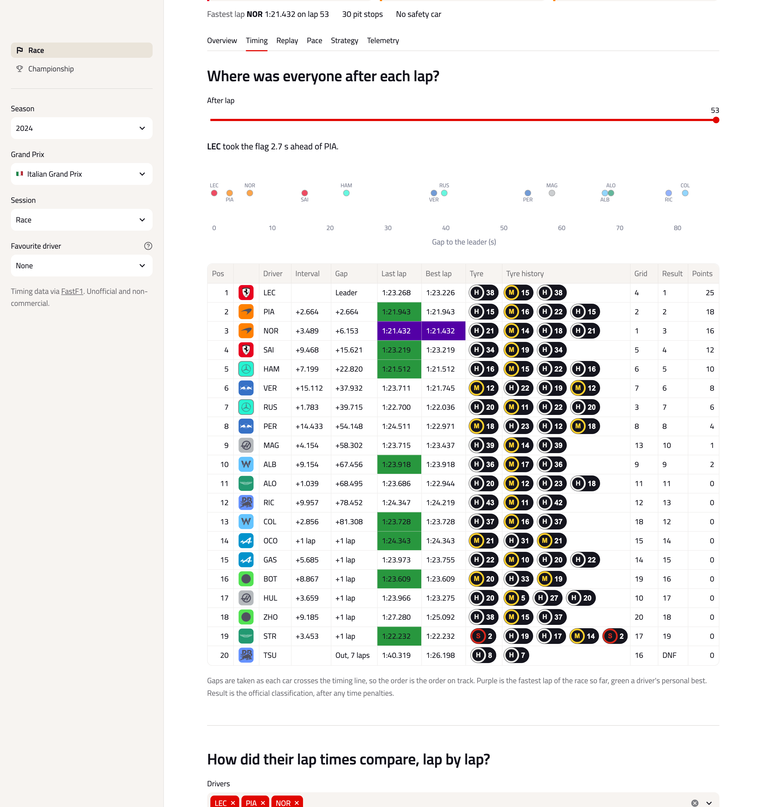
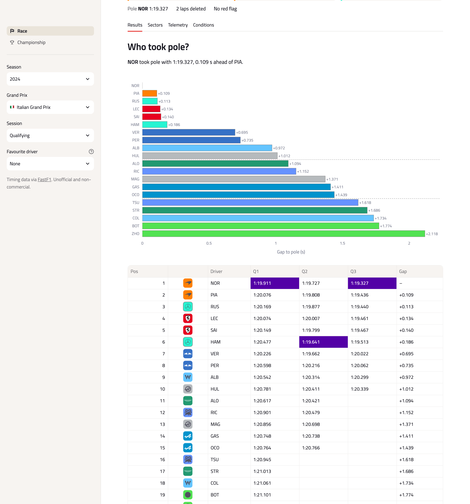

# Formula Analyst

A race analysis dashboard built on [FastF1](https://github.com/theOehrly/Fast-F1) timing data. It covers every Grand Prix weekend from 2018 to the latest 2026 round, from first practice to the race, and the championship around it.

**[Open the live app](https://formula-analyst.streamlit.app/)**


## Features

- **Race:** positions and gaps lap by lap, a timing screen for any lap, a replay on the track map, pace and tyre degradation, pit stops and undercuts, and two drivers' fastest laps compared channel by channel.
- **Strategy:** a model trained on races since 2019 predicts how much time each tyre compound loses, and a simulator ranks one- and two-stop plans against the winner's.
- **Practice, qualifying and sprints:** results, gaps to pole, long runs and sector times for every session of the weekend.
- **Championship:** drivers' and teams' standings after any round, who can still win the title, and points through the season.
- Weather, race control decisions, penalties and team radio for every session.
- Shareable links for every view, a favourite driver highlighted throughout, and light and dark themes.

<picture>
  <source media="(prefers-color-scheme: dark)" srcset="docs/overview-dark.png">
  
</picture>

| Timing | Telemetry |
| --- | --- |
|  |  |
| **Strategy simulator** | **Tyre model** |
|  |  |
| **Qualifying** | **Championship** |
|  |  |

How each number is worked out is in [docs/methodology.md](docs/methodology.md).

## Running locally

Requires Python 3.11 or newer.

```bash
python -m venv .venv
source .venv/bin/activate
pip install -r requirements.txt
streamlit run app.py
```

Or run it in Docker behind Nginx and open http://localhost:8080:

```bash
docker compose up --build
```

## Data

The live timing service blocks most hosting providers, so every session ships with the app as Parquet files in `data/`. After a race weekend, this adds the new sessions, updates the championship and retrains the tyre model:

```bash
pip install -r requirements-dev.txt
python -m src.sync --sessions
```

It has to run on a connection the timing service accepts, such as a home one. `python -m src.sync --help` lists the other options.

## Development

```bash
pip install -r requirements-dev.txt
pytest
ruff check .
```

## Credits

Timing data comes from FastF1, and results and standings from the [Jolpica F1 API](https://github.com/jolpica/jolpica-f1). Team logos are from formula1.com and belong to the teams. [Titillium Web](https://fonts.google.com/specimen/Titillium+Web) is used under the SIL Open Font License. This is an unofficial, non-commercial project and isn't affiliated with any racing series or its rights holders.

Released under the [MIT License](LICENSE).
